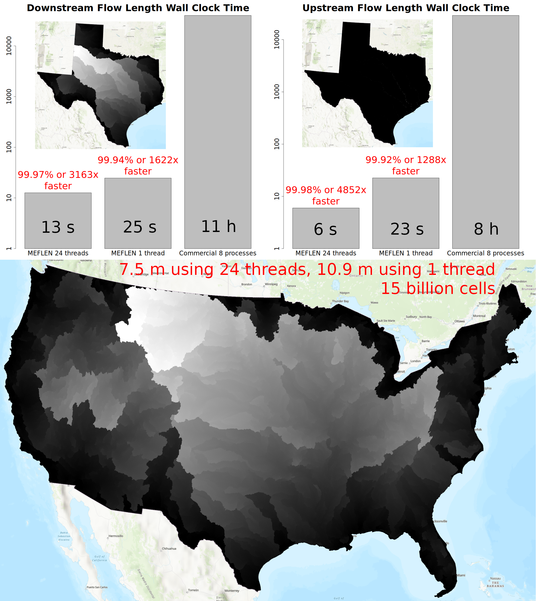

# Memory-Efficient I/O-Improved DEM Analysis System (MIDAS)

## Binaries for Windows

* [MEFA](https://github.com/HuidaeCho/mefa) (Memory-Efficient Flow Accumulation)
* [MESHED](https://github.com/HuidaeCho/meshed) (Memory-Efficient Watershed Delineation)
* MELFP (Memory-Efficient Longest Flow Path)
* MEFLEN (Memory-Efficient Flow Length)

## Testing

```dos
git clone https://github.com/HuidaeCho/midas.git
cd midas\windows\test
pretest.bat
test.bat
```

## Benchmark results

### MEFA


System specifications
* CPU: Intel Core i9-12900 @ 2.40GHz
* Cores: 16
* Logical processors: 24
* Memory: 64 GiB
* OS: Windows 11

Citation
* Huidae Cho, July 2023. Memory-Efficient Flow Accumulation Using a Look-Aroun
d Approach and Its OpenMP Parallelization. Environmental Modelling & Software
167, 105771. [doi:10.1016/j.envsoft.2023.105771](https://doi.org/10.1016/j.env
soft.2023.105771).

### MEFLEN



System specifications
* CPU: Intel Core i9-12900 @ 2.40GHz
* Cores: 16
* Logical processors: 24
* Memory: 64 GiB
* OS: Windows 11
  * Downstream flow length
    * Texas results (compute only)
      * 8.2 s (24 threads)
      * 19.6 s (1 thread)
    * CONUS results (compute only)
      * 4.7 m (24 threads)
      * 7.3 m (1 thread)
* OS: Linux 6.6.30
  * Downstream flow length
    * Texas results (compute only)
      * 9.4 s (24 threads)
      * 20.0 s (1 thread)
    * CONUS results (compute only)
      * 2.0 m (24 threads)
      * 4.0 m (1 thread)
