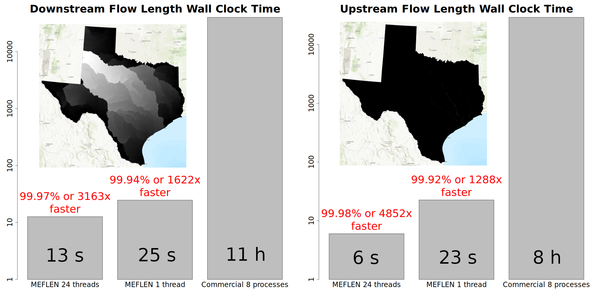

# Memory-Efficient I/O-Improved DEM Analysis System (MIDAS)

## Binaries for Windows

* [MEFA](https://github.com/HuidaeCho/mefa) (Memory-Efficient Flow Accumulation)
* [MESHED](https://github.com/HuidaeCho/meshed) (Memory-Efficient Watershed Delineation)
* MELFP (Memory-Efficient Longest Flow Path)
* MEFLEN (Memory-Efficient Flow Length)

## Testing

```dos
git clone https://github.com/HuidaeCho/midas.git
cd midas\windows\test
pretest.bat
test.bat
```

## Benchmark results

### MEFA


### MEFLEN


